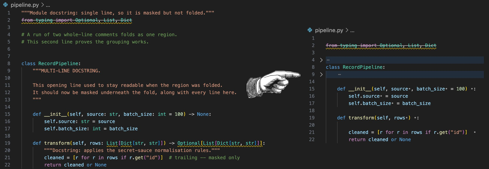
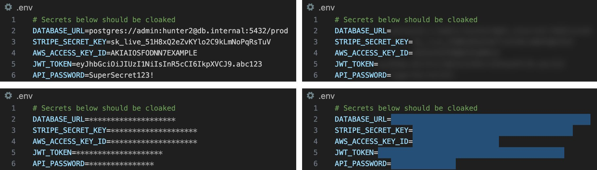

# VSC Code Cloak

Hides secrets, type annotations, comments and docstrings in the editor while you
share your screen. The terminal, diffs, IntelliSense, other
extensions and the clipboard still see the real values; copy/paste copies the
original text. `ext install tkfoss.vsc-code-cloak`. Requires VS Code 1.96.0 or later.

To install manually, download the `.vsix` from the
[latest release](https://github.com/tkfoss/vsc-code-cloak/releases/latest) and run
`code --install-extension vsc-code-cloak-<version>.vsix` (or *Extensions → … →
Install from VSIX…*).

## Commands and keys

Prefixed `Code Cloak:` in the palette. `Ctrl` is `Cmd` on macOS.

| Command | ID | Key |
|---|---|---|
| Show Menu | `codeCloak.showQuickPick` | |
| Enable / Disable / Toggle | `codeCloak.enable`, `.disable`, `.toggle` | `Ctrl+Shift+Alt+H` |
| Toggle / Hide / Show Secrets | `codeCloak.toggleSecrets`, `.hideSecrets`, `.showSecrets` | `Ctrl+Shift+Alt+S` |
| … Type Annotations | `codeCloak.toggleTypes`, `.hideTypes`, `.showTypes` | `Ctrl+Shift+Alt+T` |
| … Comments | `codeCloak.toggleComments`, `.hideComments`, `.showComments` | `Ctrl+Shift+Alt+C` |
| … Docstrings | `codeCloak.toggleDocstrings`, `.hideDocstrings`, `.showDocstrings` | `Ctrl+Shift+Alt+D` |
| Toggle Folding | `codeCloak.toggleFolding` | `Ctrl+Shift+Alt+F` |
| Fold / Unfold Cloaked Regions | `codeCloak.foldCloaked`, `.unfoldCloaked` | |
| Toggle Current Line | `codeCloak.toggleCurrentLine` | `Ctrl+Shift+Alt+L` |
| Add to Exclude List | `codeCloak.addToExcludeList` | |
| Exclude / Include This File | `codeCloak.excludeFile`, `.includeFile` | |
| Change Hiding Style | `codeCloak.changeStyle` | |

## Hiding styles

The same `.env` uncloaked, then `blur`, `stars` and `block`.

| Style | Rendering | Reveals length? |
|---|---|---|
| `text` | `appearance.hiddenText` everywhere | No |
| `compact` | `compactText` inline, `hiddenText` on a whole line | No |
| `dots` / `stars` | One `•` / `*` per character, capped at 20 | Yes, up to 20 |
| `scramble` | The same characters shuffled, deterministic per value | Yes, and the character set |
| `blur` / `block` | Blurred, or painted out, in place | Yes |

## Settings

| Setting | Default | Meaning |
|---|---|---|
| `codeCloak.enabled` | `true` | Master switch |
| `codeCloak.autoHide` | `true` | Start each session with enabled features hidden |
| `codeCloak.features.secrets` | `true` | Participate in cloaking |
| `codeCloak.features.types` / `.comments` / `.docstrings` | `false` | |
| `codeCloak.secrets.filePatterns` | see below | File names scanned for secrets |
| `codeCloak.secrets.keyPatterns` | `*KEY*`, `*TOKEN*`, `*SECRET*`, … | Keys whose values are hidden |
| `codeCloak.secrets.excludeKeys` | `PUBLIC*`, `*_TEST`, `DEBUG`, … | Keys never hidden; takes precedence |
| `codeCloak.appearance.style` | `compact` | `text`, `compact`, `dots`, `stars`, `scramble`, `blur`, `block` |
| `codeCloak.appearance.hiddenText` | `***HIDDEN***` | Marker for `text`, and for whole-line masks under `compact` |
| `codeCloak.appearance.compactText` | `•` | Inline glyph for `compact`; `""` draws nothing |
| `codeCloak.appearance.textColor` / `.backgroundColor` | `auto` | Replacement text colour; covering colour for `block` |
| `codeCloak.appearance.opacity` | `0.3` | Opacity for `blur` |
| `codeCloak.types.languages` | `typescript`, `typescriptreact`, `python` | Languages where types are hidden |
| `codeCloak.comments.hideLineComments` / `.hideBlockComments` | `true` | Mask `//`, `#`, `--` / `/* … */` |
| `codeCloak.docstrings.languages` | `python`, `jupyter` | Languages where docstrings are hidden |
| `codeCloak.folding.enabled` | `true` | Collapse cloaked regions as well as masking them |
| `codeCloak.folding.inline` / `.trimBlankLines` | `true` | Collapse runs of whole-line comments; extend folds over blank lines beneath |
| `codeCloak.folding.minimumLines` | `2` | Fewest lines a region must span before it folds |
| `codeCloak.files.excluded` | `[]` | Paths never cloaked: exact path, directory, or glob |
| `codeCloak.hover.showPreview` / `.message` | `false` | Reveal the original value on hover; hover heading |

Settings are written to the scope where they are already defined (workspace
folder, workspace, then user); `files.excluded` entries inside a workspace are
stored relative to it, in workspace scope. Patterns are shell-style wildcards,
case-insensitive against the whole string: `*` any run, `?` one character, all
else literal — `*.json` does not match `package.jsonc`. `filePatterns` matches
the file name only; `files.excluded` the full path and the file name.

## Supported formats

Secrets are scanned when the file name matches `secrets.filePatterns` **and**
the key matches `secrets.keyPatterns`. Quoted values are cloaked inside the
quotes, so a string stays distinguishable from a bare token.

| Files | Syntax recognised |
|---|---|
| `.env`, `.env.*`, `*.env`, `.envrc`, `*.sh` | `KEY=value`, `export KEY=value`, quoted values, trailing `#` comments |
| `*.json`, `*.jsonc` | `"key": value` at any depth, including comments and files not yet valid JSON |
| `*.yaml`, `*.yml` | `key: value`, list items, block scalars (`key: \|`) line by line |
| `*.properties`, `*.ini`, `*.conf`, `*.cfg`, `*.toml` | `key = value`, `key: value`; sections and `;`/`#` comments skipped |

Type annotations: TypeScript and TSX parameter, variable, property, interface
member and return annotations from the compiler's AST; Python parameter, return
and PEP 526 variable annotations. Each is hidden with its leading `:` or `->`,
so what is left reads as valid untyped code. Comments are per language — `//`
and `/* */` for C-family, `#` for Python, shell and YAML, `--` for SQL and Lua,
`<!-- -->` for markup; delimiters inside string literals are not comments.
Docstrings are Python triple-quoted strings that begin a line, including module
and class docstrings.

## Limitations

- Re-parsed 120 ms after the last keystroke, so a value is briefly visible while
  typed. Parses are cached per document version; the first after an edit is not
  free on large files.
- Multi-line type annotations are not hidden.
- A single-line construct on its own row cannot be folded away — VS Code folding
  needs two lines — so it keeps the `hiddenText` marker instead.
- `Unfold All` reveals folded regions, but the masking underneath stays.

## Development

`npm install`, then `npm run compile` (tsc → `out/`), `npm run watch`, `npm test`,
`npm run check` (lint + typecheck + tests), `npm run package` (vsce → `.vsix`),
`npm run icon`. `F5` launches an Extension Development Host. Internal design:
[ARCHITECTURE.md](ARCHITECTURE.md). MIT — see [LICENSE](LICENSE). Inspired by
[Camouflage](https://marketplace.visualstudio.com/items?itemName=zeybek.camouflage),
[Cloak](https://marketplace.visualstudio.com/items?itemName=johnpapa.vscode-cloak),
[Censitive](https://marketplace.visualstudio.com/items?itemName=1nVitr0.censitive) and
[Toggle Docstrings](https://marketplace.visualstudio.com/items?itemName=GrayRigel.toggle-docstrings).

## Releasing

Bump `version` in `package.json` (and `CHANGELOG.md`), commit, push to `main`.
CI ([.github/workflows/ci.yml](.github/workflows/ci.yml)) tests, tags `vX.Y.Z`,
creates a GitHub Release with the `.vsix`, and publishes to the VS Code
Marketplace / Open VSX if the `VSCE_PAT` / `OVSX_PAT` repo secrets are set.
Pushes that don't change the version only run the tests.
